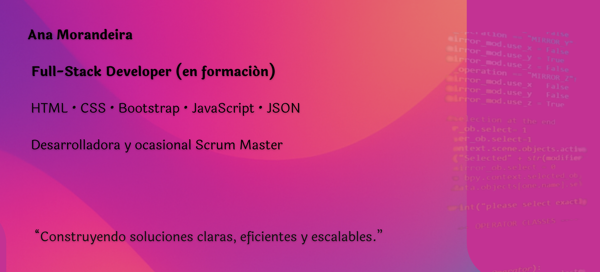

<image src="https://media4.giphy.com/media/v1.Y2lkPTc5MGI3NjExcWJvNWo5aHpmc2xzMzk0cjFlNXJ0Ym9sNTh4NzVnN2N5bzhqMG54YiZlcD12MV9pbnRlcm5hbF9naWZfYnlfaWQmY3Q9Zw/hs67xo8fGYfx5KlBgV/giphy.gif" width=150>
  

## 🛠️ Tecnologías y Herramientas

**ana-morandeira/ana-morandeira** is a ✨ _special_ ✨ repository because its `README.md` (this file) appears on your GitHub profile.

Here are some ideas to get you started:

- 🔭 I’m currently working on ...
- 🌱 I’m currently learning ...
- 👯 I’m looking to collaborate on ...
- 🤔 I’m looking for help with ...
- 💬 Ask me about ...
- 📫 How to reach me: ...
- 😄 Pronouns: ...
- ⚡ Fun fact: ...
-->
